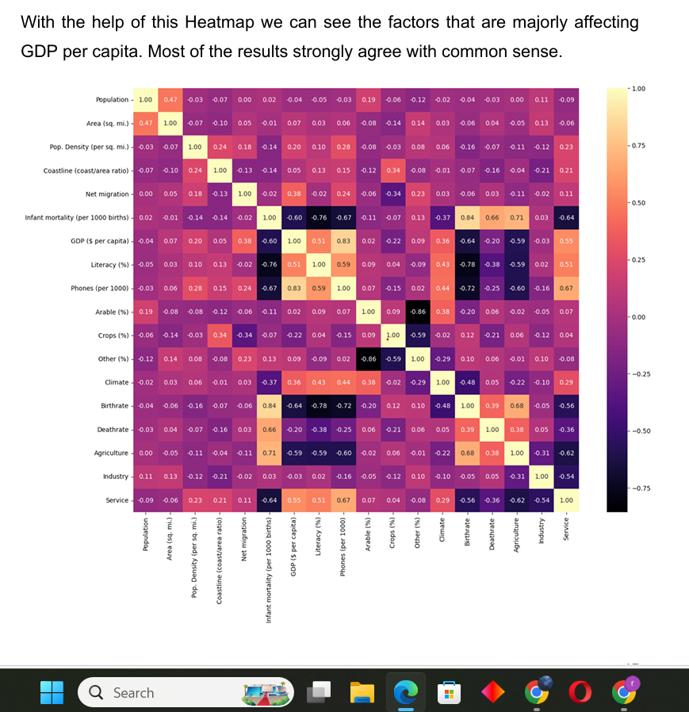
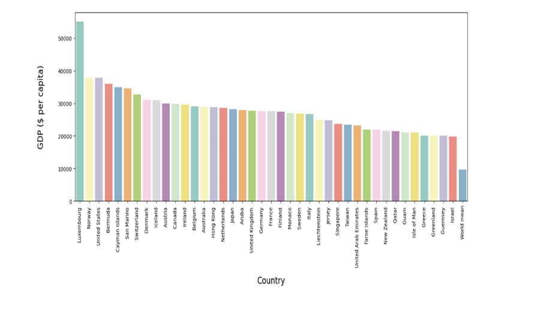
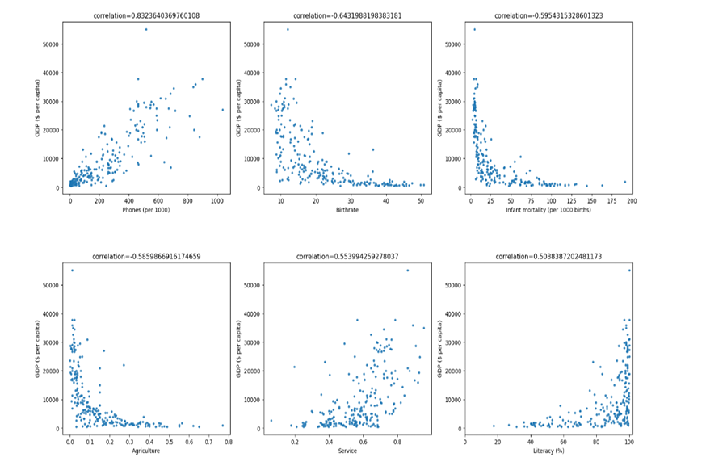
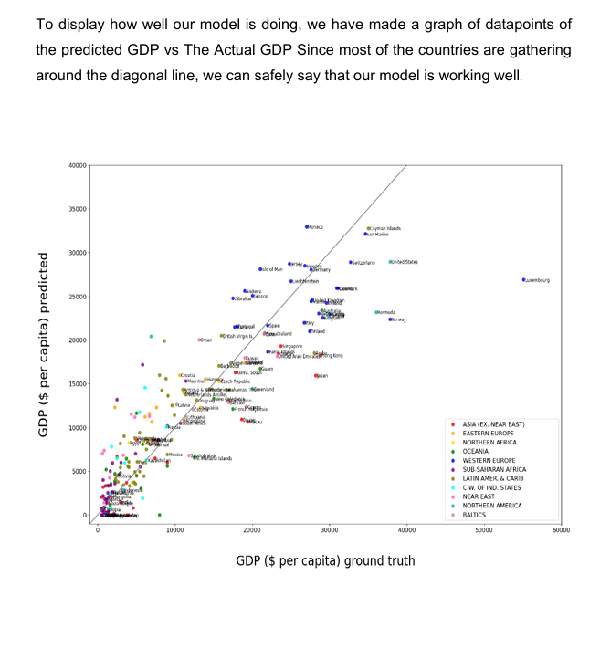
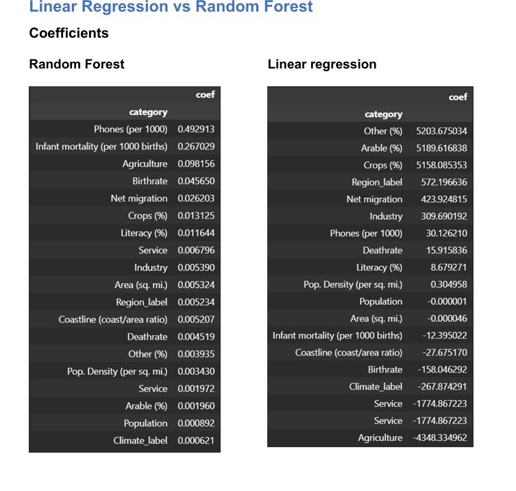
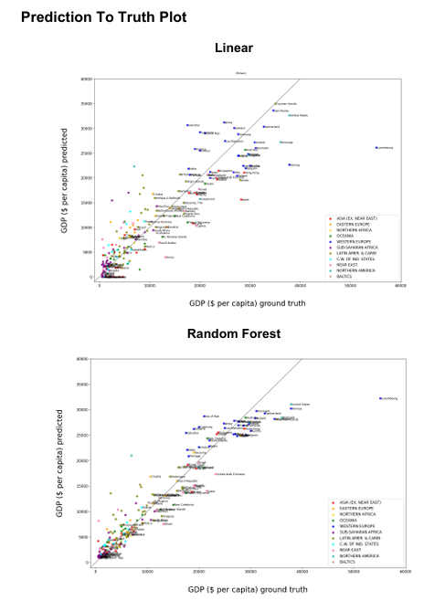
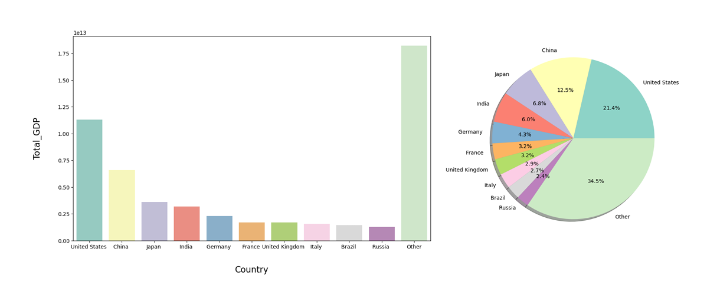
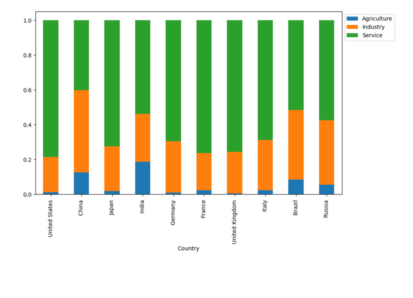

# GDP Analysis Using Python

## Project Overview
This project focuses on analyzing Gross Domestic Product (GDP) data using Python and Machine Learning techniques to identify the major economic factors influencing GDP across countries.

The project includes:
- Data collection
- Web scraping
- Data cleaning
- Exploratory Data Analysis (EDA)
- Correlation analysis
- Machine Learning model implementation
- GDP prediction and visualization

The analysis was performed using Python libraries and predictive models such as Linear Regression and Random Forest Regression.

---

## Objective
The primary objectives of this project were:

- Analyze global GDP datasets
- Identify factors affecting GDP per capita
- Compare country-wise economic performance
- Predict GDP using Machine Learning models
- Understand relationships between economic indicators

---

## Business Problem
GDP is one of the most important indicators of economic performance and national growth. Governments, policymakers, and economists rely on GDP analysis to make informed decisions regarding:
- Economic development
- Investments
- Infrastructure
- Resource allocation
- Policy implementation

This project uses data science and machine learning to provide insights into GDP trends and economic structures.

---

## Dataset Information

### Dataset Sources
- CIA World Factbook
- Kaggle

### Dataset Includes
- Population
- Literacy Rate
- Birthrate
- Deathrate
- Agriculture
- Industry
- Service Sector
- Net Migration
- Area
- Climate
- GDP per capita

---

## Technologies & Tools Used

### Programming Language
- Python

### Libraries Used
- Pandas
- NumPy
- Matplotlib
- Seaborn
- Scikit-learn
- BeautifulSoup
- Statsmodels

---

## Machine Learning Models Used

### Linear Regression
Used to identify linear relationships between GDP and economic indicators.

### Random Forest Regressor
Used for predictive modeling and improving GDP prediction accuracy through ensemble learning.

---

## Project Workflow

### 1. Data Collection
- Web scraping using BeautifulSoup
- Economic dataset collection from public sources

### 2. Data Cleaning
- Handling missing values
- Median-based imputation
- Region-wise data preprocessing

### 3. Exploratory Data Analysis (EDA)
- Correlation analysis
- Scatter plots
- GDP distribution analysis
- Country comparison

### 4. Machine Learning
- Train-test split
- Model training
- Prediction evaluation
- RMSE and MSLE analysis

---

## Key Findings

### Economic Insights
- Population and area strongly affect Total GDP.
- Agriculture, birthrate, and climate showed significant correlation with GDP per capita.
- Death rate and migration had lower impact on GDP.
- Luxembourg had the highest GDP per capita in the dataset.

### Model Performance

| Model | Accuracy |
|---|---|
| Linear Regression | 78% |
| Random Forest Regression | 91% |

### Observation
Random Forest Regression significantly outperformed Linear Regression in:
- Accuracy
- RMSE
- Prediction consistency

---

## Visualizations Included

- GDP per capita comparison
- Correlation heatmaps
- Scatter plots
- Prediction vs Actual GDP graphs
- Economic structure analysis
- Land usage analysis

---

## Team Contribution

This project was completed as part of a group academic project.

## My Contributions
- Performed data cleaning and preprocessing using Pandas
- Built correlation heatmaps and scatter plots
- Implemented Linear Regression and Random Forest models
- Compared model accuracy using RMSE and MSLE
- Generated economic insights and visualization analysis
- Assisted in project documentation and interpretation
---

## Project Structure

```text
gdp-analysis-python/
│
├── README.md
├── GDP_Analysis_Report.pdf
├── dataset/
├── notebooks/
├── screenshots/
└── visualizations/
```

---

## Visualizations

### GDP Correlation Heatmap


---

### Top GDP Countries


---

### GDP Scatterplot Analysis


---

### Prediction vs Actual GDP


---

### Linear Regression vs Random Forest


---

### Prediction Truth Plot


---

### Total GDP Analysis


---

### Economic Structure Analysis

---

## Skills Demonstrated

- Data Cleaning
- Exploratory Data Analysis (EDA)
- Web Scraping
- Machine Learning
- Regression Analysis
- Data Visualization
- Predictive Modeling
- Statistical Analysis
- Economic Data Analysis

---

## Future Improvements

- Integrate real-time economic datasets
- Use advanced forecasting models
- Expand country-wise economic indicators
- Perform time-series GDP forecasting
- Build interactive dashboards using Power BI/Tableau

---

## Conclusion

The project successfully demonstrated how Machine Learning and Data Analytics can be applied to economic data for GDP prediction and analysis.

Random Forest Regression achieved the best performance with 91% accuracy, showing strong predictive capability for GDP estimation.

The analysis highlighted the importance of population, area, agriculture, and economic structure in determining GDP performance across countries.

---

## Author
### Raj Verma

Business & Data Analytics Enthusiast

---

## References
- CIA World Factbook
- Kaggle Dataset
- Scikit-learn Documentation
- Python Official Documentation
